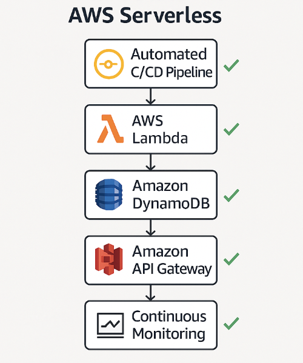

# Cost Optimization Analysis

This document presents a comprehensive cost optimization analysis for the fulfillment service of an e‑commerce project hosted on AWS in the **eu‑central‑1** region.

## Table of Contents

1. [Overview and Methodology](#1-overview-and-methodology)
    - [Objectives](#objectives)
    - [Define the Inputs](#define-the-inputs)
    - [Develop Cost Estimates](#develop-cost-estimates)
    - [Business Value Analysis](#business-value-analysis)
    - [Value Stream Mapping](#value-stream-mapping)
2. [Detailed Inputs and Cost Calculations](#2-detailed-inputs-and-cost-calculations)
    - [Client-Provided Data](#client-provided-data)
    - [Estimate Summary](#estimate-summary)
3. [Business Value Analysis](#3-business-value-analysis)
4. [Value stream mapping](#4-value-stream-mapping)
5. [Conclusion](#5-conclusion)

---

## 1. Overview and Methodology

### Objectives
- **Define the Inputs:** Be sure to consider both usage metrics and configuration settings.
- **Develop Cost Estimates:** Use right sizing and on‑demand pricing to model the solution’s costs.
- **Conduct Business Value Analysis:** Leverage the AWS Cloud Value Framework to identify and quantify key business drivers.
- **Perform Value Stream Mapping:** Analyze and visualize the workflow map of the AWS solution.

---

### Define the Inputs

- Usage Metrics - total invocations, execution duration, data transfer, and build minutes.
- Configuration Settings - provisioned vs. on‑demand pricing, auto-scaling, indexing, and concurrency settings.
- Additional Features - backups, streams, transactions, monitoring, and logging.
- Fixed vs. Variable Costs - annual reserved costs versus variable usage costs.

#### DynamoDB Tables

- **Throughput & Capacity:**
    - **Expected WCU (Write Capacity Unit) & RCU (Read Capacity Unit):**
        - Provisioned vs. on‑demand pricing models.
        - Auto-scaling configuration and its impact on costs.
- **Data & Storage:**
    - **Expected Table Size & Item Count:**
        - Average item size (e.g., 1,517.88 bytes).
        - Storage costs per GB.
- **Indexing:**
    - **Global Secondary Indexes (GSI) and Local Secondary Indexes (LSI):**
        - Additional WCUs/RCUs required for indexes.
- **Additional Features:**
    - **Backups & Restores:**
        - On‑demand backups and point‑in‑time recovery (PITR) costs.
    - **DynamoDB Streams:**
        - Charges based on the volume of data processed.
        - DynamoDB does not charge for GetRecords API calls invoked by AWS Lambda as part of DynamoDB triggers.
    - **Transactions:**
        - Additional costs if using transactional operations.
    - **DynamoDB Accelerator (DAX):**
        - If used, include DAX node pricing and any associated data transfer costs.
- **Data Transfer:**
    - **Inter‑Region or Outbound Data:**
        - Costs associated with data moving in or out of DynamoDB.

---

### AWS Lambda Functions

- **Execution Metrics:**
    - **Expected Number of Invocations:**
        - Total invocations per month/year.
    - **Execution Duration:**
        - Average duration in milliseconds.
    - **Memory Allocation:**
        - Configured memory (affects cost per GB‑second).
    - **Ephemeral Storage Usage:**
        - Costs if additional temporary storage is used beyond the default.
- **Concurrency & Scaling:**
    - **Expected Concurrent Executions:**
        - Consider the impact on throttling and scaling.
    - **Provisioned Concurrency:**
        - If enabled, additional charges for keeping functions warm.
- **VPC Integration:**
    - **ENI (Elastic Network Interface) Setup:**
        - Additional setup time and data transfer costs for Lambdas running in a VPC.
- **Additional Considerations:**
    - **Cold Starts:**
        - Impact on performance (may indirectly affect cost if using provisioned concurrency).
    - **Monitoring & Logging:**
        - CloudWatch Logs for Lambda execution data.

---

### API Gateway

- **API Calls:**
    - **Number of Endpoints & Requests:**
        - Example: One endpoint handling 1 million API calls daily.
- **Data Transfer:**
    - **Outbound Data & Caching:**
        - Costs for data transfer out of API Gateway.
        - Cache usage (if enabled) and its capacity.
- **Integration Types:**
    - **REST vs. HTTP vs. WebSocket APIs:**
        - Pricing differences and supported features.

---

### CloudWatch

- **Logging & Metrics:**
    - **Log Ingestion Volume:**
        - Data ingested per day/month.
    - **Custom Metrics:**
        - Number and resolution of custom metrics.
    - **Alarms & Dashboards:**
        - Number of alarms and dashboards in use.
    - **Retention Period:**
        - Duration logs/metrics are stored (affects storage costs).

---

### CodeBuild

- **Build Environment:**
    - **Build Minutes:**
        - Estimated minutes per build multiplied by frequency (e.g., every two weeks).
    - **Compute Type:**
        - The instance type used during builds.
    - **Storage Usage:**
        - Temporary storage required for builds.

---

### VPC (Virtual Private Cloud)

- **Network Resources:**
    - **NAT Gateway and VPC Endpoints:**
        - Hourly costs for NAT gateways and data processed by endpoints.
    - **Data Transfer:**
        - Costs for data transfer between Availability Zones or out of the VPC.
- **Reserved/Annual Costs:**
    - **Fixed Infrastructure Charges:**
        - Any fixed annual network resource costs provided.

---

### SQS (Simple Queue Service)

- **Message Processing:**
    - **Message Volume:**
        - Number of messages processed (differentiate between FIFO and Standard queues).
    - **Message Size:**
        - Impact on cost per request depending on payload size.
- **Features:**
    - **Long Polling:**
        - Can reduce the number of empty responses and thus lower costs.
    - **Delivery Delays & Visibility Timeout:**
        - Configuration settings that may impact performance and cost.

---

### Secrets Manager & SSM Parameter Store

- **Secret/Parameter Management:**
    - **Number of Secrets/Parameters Stored:**
        - Base storage cost per secret/parameter.
    - **API Calls:**
        - Frequency of retrieval or update operations (each call may incur a cost).
- **Additional Charges:**
    - **KMS (Key Management Service) Usage:**
        - Costs associated with API calls if using KMS for encryption.

---

### Develop Cost Estimates

Focus on accurately modeling the solution’s costs by using the following strategies:

- **Right Sizing:**  
  - Analyzing each service's usage patterns and selecting the most appropriate resource size. 
  - Examples:
    - Determine the optimal WCU/RCU for DynamoDB tables.
    - Set the right memory and execution duration for Lambda functions.
    - Appropriately size API Gateway endpoints based on expected API calls.

- **On‑Demand Pricing:**
  - Optimize cost efficiency by utilizing AWS's On-Demand pricing model, which allows payment for compute capacity by the hour or second without long-term commitments, aligning expenses with actual usage - this ensures that we pay only for the resources consumed, reflecting real-world usage patterns.
  - Examples services that support the on-demand pricing model include DynamoDB, Lambda, EC2...

This approach ensures that the estimated costs cover both variable usage and any fixed, underlying infrastructure costs.

---

### Business Value Analysis

Business Value Analysis aims to assess and articulate how a given solution enhances business performance. This involves translating technical benefits into metrics that resonate with business stakeholders, focusing on aspects such as:

- **Cost Savings:**
  - Transitioning from capital expenditures (CapEx) to operational expenditures (OpEx) and adopting usage-based billing models.
- **Operational Efficiency:**
    - Reducing the need for extensive infrastructure management.
- **Developer Productivity:**
    - Enabling faster release cycles and reducing the incidence of defects.
- **Resilience and Scalability:**
    - Ensuring system uptime during demand spikes.
- **Innovation Enablement:**
    - Allowing teams to focus more on feature development rather than infrastructure concerns.

The analysis should focus on metrics that are most pertinent to the customer, such as cost, time, personnel, and performance. It is also important to align the discussion with the customer's specific goals and challenges.

---

### Value stream mapping

Value Stream Mapping involves analyzing and visualizing the sequence of steps required to deliver a product or service, with the goal of identifying and eliminating inefficiencies. By adopting serverless services such as AWS Lambda, Amazon API Gateway, and Amazon DynamoDB, organizations can streamline their workflows, reducing manual interventions and infrastructure management tasks. This leads to faster deployments, minimized hand-offs, and a more agile development process. This approach not only accelerates time-to-market but also enhances overall operational efficiency.

---

## 2. Detailed Inputs and Cost Calculations

## Client-Provided Data

The client has provided the following metrics for their operations:

- **Orders per Month:** 650,000
- **Consignments:**
    - **Created per Month:** 700,000
    - **Average Item Size:** 1,500 bytes
    - **Reads per Month:** 10,000,000
- **Shipments:**
    - **Created per Month:** 650,000
    - **Average Item Size:** 1000 bytes
    - **Reads per Month:** 10,000,000
- **Packages:**
    - **Created per Month:** 710,000
    - **Average Item Size:** 1000 bytes
    - **Reads per Month:** 20,000,000

The client's region is eu-central-1. We will be using AWS’s on‑demand pricing model where possible to align expenses with actual service usage.

### Estimate Summary

| Upfront Cost (USD) | Monthly Cost (USD) | Total 12‑Month Cost (USD) | Currency |
|--------------------|--------------------|----------------------------|----------|
| 0                  | 224.44             | 2,693.28                   | USD      |

---

### Detailed Estimate

#### Network & Monitoring

| Description        | Service           | Upfront (USD) | Monthly (USD) | 12‑Month Total (USD) | Configuration Summary                                               |
|--------------------|-------------------|---------------|---------------|----------------------|---------------------------------------------------------------------|
| Transit Gateway    | VPC               | 0             | 45.17         | 542.04               | Number of Transit Gateway attachments (1)                           |
| CloudWatch metrics | Amazon CloudWatch | 0             | 21.30         | 255.60               | Number of Metrics (detailed & custom) (50); Logs scanned (1,000GB) |
| AWS CodeBuild      | AWS CodeBuild     | 0             | 0.20          | 2.40                 | Compute Type: On‑Demand EC2; OS: Linux; Instance: general1.small; Builds: 4; Instances: 1 |

#### DynamoDB

| Description                             | Service                     | Upfront (USD) | Monthly (USD) | 12‑Month Total (USD) | Configuration Summary                                                     |
|-----------------------------------------|-----------------------------|---------------|---------------|----------------------|---------------------------------------------------------------------------|
| Consignments table – On‑demand capacity | DynamoDB on‑demand capacity | 0             | 7.27          | 87.24                | Table class: Standard; Avg item size: 1,500B; Storage: 12GB              |
| Consignments table – Streams            | DynamoDB Streams            | 0             | 0.00          | 0.00                 | GetRecord API requests: 0 per month                                       |
| Consignments table – Backup & restore   | DynamoDB Backup and restore | 0             | 6.61          | 79.32                | Backup storage: 12GB; PITR storage: 12GB; Data restored: 12GB           |
| Shipments table – On‑demand capacity    | DynamoDB on‑demand capacity | 0             | 5.07          | 60.84                | Table class: Standard; Avg item size: 1,000B; Storage: 8GB               |
| Shipments table – Streams               | DynamoDB Streams            | 0             | 0.00          | 0.00                 | GetRecord API requests: 0 per month                                       |
| Shipments table – Backup & restore      | DynamoDB Backup and restore | 0             | 4.41          | 52.92                | Backup storage: 8GB; PITR storage: 8GB; Data restored: 8GB              |
| Packages table – On‑demand capacity     | DynamoDB on‑demand capacity | 0             | 8.13          | 97.56                | Table class: Standard; Avg item size: 1,000B; Storage: 9GB               |
| Packages table – Streams                | DynamoDB Streams            | 0             | 0.00          | 0.00                 | GetRecord API requests: 0 per month                                       |
| Packages table – Backup & restore       | DynamoDB Backup and restore | 0             | 4.96          | 59.52                | Backup storage: 9GB; PITR storage: 9GB; Data restored: 9GB              |
| DLQ table – On‑demand capacity          | DynamoDB on‑demand capacity | 0             | 2.68          | 32.16                | Table class: Standard; Avg item size: 10,000B; Storage: 6GB              |
| DLQ table – Backup & restore            | DynamoDB Backup and restore | 0             | 0.73          | 8.76                 | Backup storage: 6GB; PITR storage: 0GB; Data restored: 0GB              |
| Idempotency table – On‑demand capacity  | DynamoDB on‑demand capacity | 0             | 1.83          | 21.96                | Table class: Standard; Avg item size: 200B; Storage: 1GB                 |
| Idempotency table – Backup & restore    | DynamoDB Backup and restore | 0             | 0.12          | 1.44                 | Backup storage: 1GB                                                      |

#### Lambda Functions

| Description                  | Service    | Upfront (USD) | Monthly (USD) | 12‑Month Total (USD) | Configuration Summary                                                         |
|------------------------------|------------|---------------|---------------|----------------------|-------------------------------------------------------------------------------|
| Domain Event Publisher       | AWS Lambda | 0             | 4.55          | 54.60                | Invoke Mode: Buffered; Arch: x86; Requests: 5M/month; Storage: 512MB        |
| Package status update        | AWS Lambda | 0             | 1.87          | 22.44                | Invoke Mode: Buffered; Arch: x86; Requests: 2M/month; Storage: 512MB        |
| Kafka decoder                | AWS Lambda | 0             | 1.87          | 22.44                | Arch: x86; Invoke Mode: Buffered; Requests: 2M/month; Storage: 512MB        |
| Failed messages redrive      | AWS Lambda | 0             | 1.87          | 22.44                | Arch: x86; Invoke Mode: Buffered; Requests: 2M/month; Storage: 512MB        |
| Entities Mapper              | AWS Lambda | 0             | 1.87          | 22.44                | Arch: x86; Invoke Mode: Buffered; Requests: 2M/month; Storage: 512MB        |
| Get shipments                | AWS Lambda | 0             | 1.87          | 22.44                | Arch: x86; Invoke Mode: Buffered; Requests: 2M/month; Storage: 512MB        |
| Get consignments             | AWS Lambda | 0             | 1.87          | 22.44                | Arch: x86; Invoke Mode: Buffered; Requests: 2M/month; Storage: 512MB        |
| Get packages                 | AWS Lambda | 0             | 1.87          | 22.44                | Arch: x86; Invoke Mode: Buffered; Requests: 2M/month; Storage: 512MB        |
| DynamoDB Stream Listener     | AWS Lambda | 0             | 1.87          | 22.44                | Arch: x86; Invoke Mode: Buffered; Requests: 2M/month; Storage: 512MB        |

#### API Gateway

| Description           | Service             | Upfront (USD) | Monthly (USD) | 12‑Month Total (USD) | Configuration Summary                                                               |
|-----------------------|---------------------|---------------|---------------|----------------------|-------------------------------------------------------------------------------------|
| Package status update | Amazon API Gateway  | 0             | 37.00         | 444.00               | HTTP API requests (M); REST API requests (M); Cache: None; WebSocket (K); Size: 32KB; 10/month |
| Get consignments      | Amazon API Gateway  | 0             | 18.50         | 222.00               | HTTP API requests (M); Avg size: 34KB; REST API requests (M); Cache: None; WebSocket (K); 5/month |
| Get shipments         | Amazon API Gateway  | 0             | 18.50         | 222.00               | HTTP API requests (M); Avg size: 34KB; REST API requests (M); Cache: None; WebSocket (K); 5/month |
| Get packages          | Amazon API Gateway  | 0             | 18.50         | 222.00               | HTTP API requests (M); Avg size: 34KB; REST API requests (M); Cache: None; WebSocket (K); 5/month |

#### SQS Queues

| Description           | Service    | Upfront (USD) | Monthly (USD) | 12‑Month Total (USD) | Configuration Summary                          |
|-----------------------|------------|---------------|---------------|----------------------|------------------------------------------------|
| DynamoDB Stream       | Amazon SQS | 0             | 2.50          | 30.00                | DT Inbound: 0TB; DT Outbound: 0TB; FIFO: 5M/month |
| Kafka message decoder | Amazon SQS | 0             | 1.00          | 12.00                | DT Inbound: 0TB; DT Outbound: 0TB; FIFO: 2M/month |

#### Configuration

| Description              | Service             | Upfront (USD) | Monthly (USD) | 12‑Month Total (USD) | Configuration Summary              |
|--------------------------|---------------------|---------------|---------------|----------------------|------------------------------------|
| Kafka credentials secret | AWS Secrets Manager | 0             | 0.45          | 5.40                 | Secrets: 1; Duration: 30 days; API calls: 10,000 |

---

## 3. Business Value Analysis

Implementing a serverless architecture using AWS services offers the following business benefits:

- **Cost Efficiency:**  
   By adopting serverless technologies, the company shifts from CapEx to OpEx, paying only for actual usage. This approach can lead to significant cost reductions; for instance, [businesses have reported up to 68 percent of development costs reduction](https://pages.awscloud.com/global-ln-gc-300-deloitte-tco-mod-report-learn) by automatically allocating compute on a pay-for-use basis. Using on‑demand pricing for DynamoDB and serverless services (Lambda, API Gateway) minimizes over‑provisioning and reduces operational overhead.
- **Operational Efficiency:**  
  Serverless architectures eliminate the need for server provisioning and management, reducing operational overhead. This allows teams to focus on core business functions rather than infrastructure maintenance.
- **Developer Productivity:**  
  Integrating CI/CD pipelines with services like AWS CodeBuild, CodeDeploy, and CodePipeline automates deployments, leading to faster release cycles and improved application quality. This automation enables developers to concentrate on writing code and developing features.
- **Resilience and Scalability:**  
  Serverless services automatically scale to handle varying loads, ensuring high availability during traffic spikes without manual intervention. This scalability enhances customer satisfaction by maintaining performance during peak periods.
- **Innovation Enablement:**  
  With reduced concerns about infrastructure management, development teams can allocate more resources to innovation and feature development, aligning with business objectives and responding swiftly to market demands.

---

## 4. Value Stream Mapping

Value Stream Mapping involves analyzing and visualizing the workflow associated with managing consignments, shipments, and packages in the context of an AWS serverless architecture. This process aims to identify and eliminate inefficiencies, redundancies, and bottlenecks, thereby enhancing overall operational efficiency. Fulfillment process workflow:

1. **Event Ingestion:**
    - **Source:** An external Kafka topic publishes events related to consignments, shipments, and packages.
    - **Processing:** An AWS Lambda function subscribes to this topic, decodes incoming events, maps them to the appropriate entity, and saves the data into Amazon DynamoDB.

2. **Database Triggers:**
    - **Change Detection:** DynamoDB Streams capture changes (inserts, updates, deletes) to database items.
    - **Event Emission:** A Lambda function is triggered by these streams to emit events reflecting the entity changes.

3. **API Interactions:**
    - **Data Retrieval:** Clients fetch entity details via Amazon API Gateway, which invokes Lambda functions to query DynamoDB and return the requested information.
    - **Status Updates:** Clients update package statuses through API Gateway, triggering Lambda functions that modify the corresponding items in DynamoDB.

4. **Message Queuing:**
    - **Asynchronous Processing:** Certain tasks are offloaded to Amazon Simple Queue Service (SQS) to decouple components and manage workloads efficiently.
    - **Error Handling:** Dead Letter Queues (DLQs) are implemented to capture and analyze failed messages, ensuring reliability and facilitating debugging.

5. **Continuous Integration and Deployment (CI/CD):**
    - **Pipeline Components:** AWS CodePipeline orchestrates the deployment process, utilizing AWS CodeBuild for building artifacts and AWS CodeDeploy for deploying them.
    - **Automation:** This setup automates testing and deployment, enabling rapid and reliable updates to the application.

6. **Continuous Monitoring:**
    - **Performance Tracking:** Utilize AWS CloudWatch to monitor Lambda function performance, DynamoDB throughput, and API Gateway metrics.
    - **Log Analysis:** Implement centralized logging to analyze system behavior, detect anomalies, and facilitate troubleshooting.
    - **Feedback Loop:** Regularly review monitoring data to identify areas for improvement, ensuring the fulfillment process remains efficient and responsive to changing demands.

## Eliminated Inefficiencies

- **Manual Infrastructure Management:** Leveraging serverless services like Lambda, DynamoDB, and API Gateway removes the need for provisioning and maintaining servers, reducing operational overhead.

- **Tight Coupling:** Utilizing SQS for asynchronous processing decouples system components, enhancing scalability and fault tolerance.

- **Error Handling Delays:** Implementing DLQs ensures that failed messages are promptly captured and addressed, improving system resilience.

- **Deployment Bottlenecks:** The CI/CD pipeline automates the build and deployment process, minimizing manual interventions and accelerating release cycles.

- **Process Visibility:** Continuous monitoring provides real-time insights into system performance, enabling proactive identification and resolution of inefficiencies.

## Enhanced Outcomes

- **Scalability:** The serverless architecture automatically scales with demand, accommodating varying workloads without manual intervention.

- **Cost Efficiency:** Pay-as-you-go pricing for serverless services ensures that costs align with actual usage, avoiding expenses associated with over-provisioning.

- **Developer Productivity:** By offloading infrastructure concerns to AWS, the development team can focus on application logic and business value, fostering innovation and reducing time-to-market.

- **Operational Agility:** Continuous monitoring and feedback loops enable rapid adaptation to change business requirements and customer expectations.

By mapping out this streamlined workflow, the fulfillment service achieves a more efficient, reliable, and scalable operation, ultimately delivering enhanced value to both the business and its customers.

---

## 5. Conclusion

This cost optimization analysis provides a comprehensive view of the fulfillment service solution in the eu‑central‑1 region:
- **Inputs:** Detailed metrics for DynamoDB (on‑demand), Lambda functions, API Gateway, CloudWatch, CodeBuild, VPC, SQS, Secrets Manager, and SSM Parameter Store.
- **Estimation:**  
  The annual cost is approximated at **~$2,357.30** based on current usage metrics.
- **Business Value:**  
  The solution delivers significant benefits in cost efficiency, scalability, operational agility, and overall system reliability.

By continuously monitoring usage and adjusting configurations, the customer can further optimize costs while maintaining high performance and responsiveness.

---
